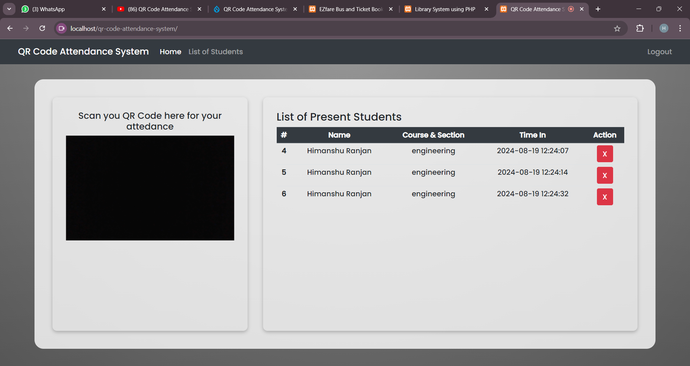
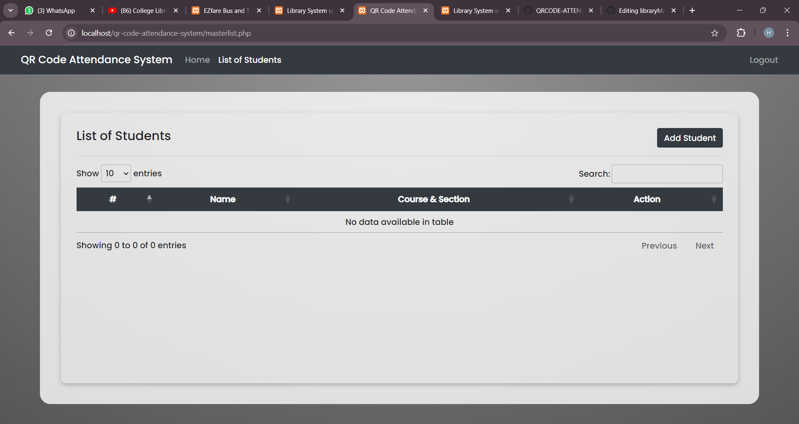
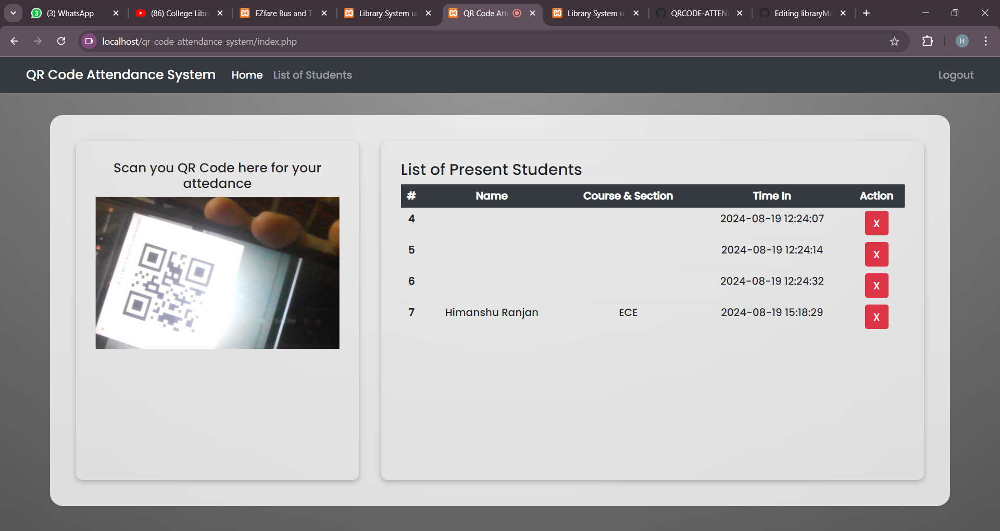
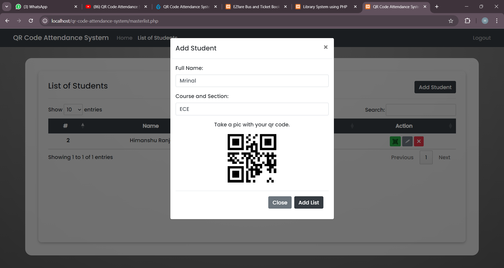
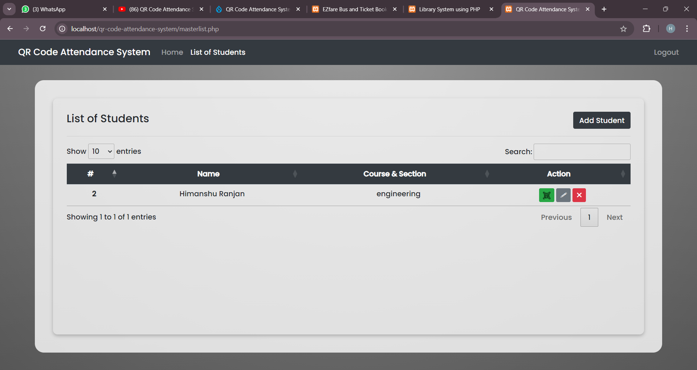
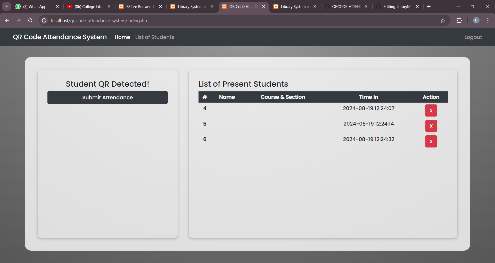

# QRCODE ATTENDENCE Management System

## **Table of Contents**
- [**Description**](#description)
- [**How to setup this project**](#how-to-setup-this-project)
- [**Technologies Used**](#technologies-used)
- [**features**](#features)
- [**Usage**](#usage)
- [**Preview**](#preview)
- [**Deployed link**](#deployed-link)
- [**Future Development**](#future-development)
- [**Questions**](#questions)


## **Description**

1. **QR Code Scanning**: Students can easily mark their attendance by scanning a unique QR code assigned to them.
2. **Real-time Updates**: Attendance records are updated instantly, providing real-time insights for administrators.
3. **Student Management**: Efficiently manage student information, including names, courses, and sections.
4. **Data Visualization**: Generate reports and analytics to track attendance trends over time.
5. **Comprehensive Reports**: Create detailed attendance reports for better tracking and analysis.
## **How to setup this project**
```
Step 1st. Download xampp
```
```
Step 2nd. Text editor notepad++ or Sublime
```
```
Step 3rd. Download the zip file/ Download winrar
```
```
Step 4th. Extract the file and copy “libsystem” folder
```
```
Step 5th. Paste inside root directory/ where you install xampp local disk C: drive D: drive E: paste: for xampp/htdocs,
```
```
Step 6th. Open PHPMyAdmin http://localhost/phpmyadmin
```
```
Step 7th. Create database name qr_attendance_db
```
```
Step 8th. Import qr_attendance_db.sql file given inside the zip package in SQL file folder
```
```
Step 9th. Run the script http://localhost/qr_attendance_db 
```


## **Technologies Used**
* **PHP**: The backend scripting language used for server-side logic and database interactions.
* **MySQL**: A powerful relational database management system employed for storing and retrieving attendance data efficiently.
* **Bootstrap**: Incorporates Bootstrap framework for responsive and visually appealing front-end design.
* **jQuery**: Enhances interactivity and functionality of the web application.
* **Instascan**: Integrates Instascan library for QR code scanning functionality.

## **features** 

1. **QR Code Scanning**: Students can quickly mark their attendance by scanning a unique QR code assigned to them.
2. **Real-time Updates**: Attendance records are instantly updated in the system, providing administrators with real-time insights.
3. **Student Management**: Easily manage student information, including names, courses, and sections.
4. **Data Visualization**: Generate comprehensive reports and analytics to track attendance trends over time.
## **How to Usage**

1. **Scan QR Code**: Students should launch the QR Code Attendance System and scan their unique QR code displayed on their devices.
2. **Record Attendance**: Upon successful scanning, the system automatically records the student's attendance.
3. **View Attendance Records**: Administrators can view and manage attendance records, including student names, courses, sections, and time in.
4. **Add and Manage Students**: Easily add new students to the system or update existing student information via the provided interface.
5.**Generate QR Codes**: Generate QR codes for new students and associate them with their profiles for seamless attendance tracking.


## **Preview**

* **Library Management System**
* **Landing Page**

* **Student Masterlist Page**

* **Add Student Modal**

* **Sample Generated QR Code**

* **Added Student**

* **Scanning QR Code**

* **QR Detected Notification**

* **User login**

* **Added Attendance**


## **Deployed link**

A deployed link is the [ <a href="https://himanshuranjan977.github.io/libraryManagementSystem/" target="_blank">here</a>]  where your project is hosted and accessible to users, allowing them to interact with your application in a real environment.

## **Conclusion**
In summary, the QR Code Attendance System simplifies attendance tracking and boosts efficiency in educational settings. By combining QR code technology with PHP and MySQL, it offers real-time updates, easy management, and detailed reporting, helping institutions save time and focus more on academic goals.
## **Questions**

* Contact me on my GitHub profile: [Himanshu's GitHub](https://github.com/himanshuranjan977)
